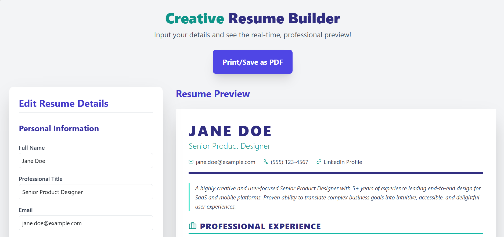

# 📄 Resume Builder — React Web App

<p align="center">
  A clean and interactive <b>Resume Builder Application</b> built with React.<br/>
  Designed to help users generate structured resumes with a simple and user-friendly interface.
</p>

<p align="center">
  
  
  
</p>

---

## 📌 Table of Contents

* [✨ Overview](#-overview)
* [🚀 Live Demo](#-live-demo)
* [🔥 Key Highlights](#-key-highlights)
* [🧩 Features](#-features)
* [🏗 Architecture](#-architecture)
* [📂 Project Structure](#-project-structure)
* [⚙️ Tech Stack](#️-tech-stack)
* [🛠 Getting Started](#-getting-started)
* [📸 Screenshots](#-screenshots)
* [📈 Future Improvements](#-future-improvements)
* [🤝 Contributing](#-contributing)
* [👨‍💻 Author](#-author)

---

## ✨ Overview

This project is a **React-based Resume Builder** that allows users to create structured resumes through a simple UI.

It demonstrates:

* Component-based architecture
* Clean project structure
* Basic state management in React
* Reusable UI components

---


## 🔥 Key Highlights

* ⚡ Built using Create React App
* 🧩 Modular component structure
* 🎯 Focused on simplicity and usability
* 📄 Resume generation interface
* 🧱 Clean and beginner-to-intermediate level architecture

---

## 🧩 Features

* 📄 Create and manage resume content
* 🧾 Structured resume layout
* 🎨 Simple and clean UI
* 🔄 Dynamic updates using React state
* 📱 Responsive design

---

## 🏗 Architecture

```text id="6k5qxp"
User Input → React Components → State Update → UI Render
```

---

## 📂 Project Structure

```bash id="0hv6t6"
quick/
├── public/
│   ├── index.html
│   ├── favicon.ico
│   └── manifest.json
│
├── src/
│   ├── components/
│   │   └── Resume.js
│   │
│   ├── App.js
│   ├── App.css
│   ├── index.js
│   └── index.css
│
├── package.json
└── README.md
```

---

## ⚙️ Tech Stack

| Category | Technology       |
| -------- | ---------------- |
| Frontend | React.js         |
| Styling  | CSS              |
| Tooling  | Create React App |

---

## 🛠 Getting Started

### 1️⃣ Clone the repository

```bash id="xfqjba"
git clone https://github.com/vinushinde2525-sys/React-Resume-builder-App.git

cd resume-builder-app
```

### 2️⃣ Install dependencies

```bash id="fj1gm6"
npm install
```

### 3️⃣ Run the application

```bash id="88k9fg"
npm start
```

App runs at:
👉 http://localhost:3000

---

## 📸 Screenshots



---

## 📈 Future Improvements

* 📥 Download resume as PDF
* 🎨 Multiple resume templates
* 🔐 User authentication
* 💾 Save resumes locally or in cloud
* ✏️ Drag-and-drop section editing

---

## 🤝 Contributing

Contributions are welcome!

1. Fork the repository
2. Create a new branch
3. Make changes
4. Submit a Pull Request

---

## 👨‍💻 Author

**Vinayak**
🔗 GitHub: https://github.com/vinushinde2525-sys

---

<p align="center">
  ⭐ Star this repo if you found it useful!
</p>
